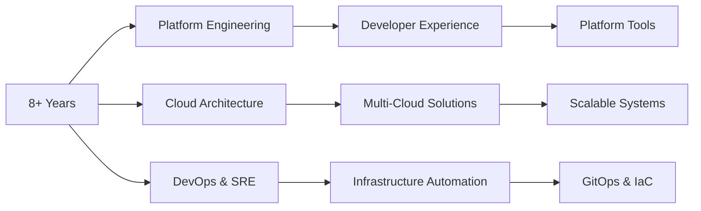

 <div align="center">
  
</div>

<div align="center">
  
</div>

---


# 👋 Hi there, I'm **Mohan SG**

 **Platform Engineer | Cloud Native Architect | Infrastructure Evangelist**

> *"Building scalable, resilient infrastructure that powers the digital world"*

## 🚀 About Me

```yaml
apiVersion: v1
kind: Engineer
metadata:
  name: mohan-sg
  namespace: platform-engineering
spec:
  experience: 8+ years
  specializations:
    - Cloud Native Architecture
    - Kubernetes & Container Orchestration
    - Infrastructure as Code (IaC)
    - Site Reliability Engineering (SRE)
    - DevOps & CI/CD Pipelines
    - Observability & Monitoring
  currentFocus:
    - Platform Engineering
    - AI/ML Infrastructure
    - Developer Experience (DX)
  motto: "Automate Everything, Monitor Everything, Scale Everything"
```

### 🎯 **What I Do**
- 🏗️ **Platform Engineering**: Design and build developer platforms that enable teams to ship faster
- ☁️ **Cloud Architecture**: Architect multi-cloud solutions on AWS, Azure, and GCP
- 🔧 **Infrastructure Automation**: Terraform, Ansible, and GitOps for everything
- 📊 **Observability**: Prometheus, Grafana, Jaeger for full-stack monitoring
- 🚢 **Container Orchestration**: Kubernetes, Docker, and service mesh technologies

---

## 🛠️ **Technology Arsenal**

<details>
<summary><b>🏗️ Platform & Infrastructure</b></summary>
<br>

| Category | Technologies |
|----------|-------------|
| **Container Orchestration** |    |
| **Service Mesh** |   |
| **Infrastructure as Code** |    |
| **GitOps & CI/CD** |    |

</details>

<details>
<summary><b>☁️ Cloud Platforms</b></summary>
<br>


</details>

<details>
<summary><b>📊 Observability & Monitoring</b></summary>
<br>


</details>

<details>
<summary><b>💻 Programming & Scripting</b></summary>
<br>


</details>

<details>
<summary><b>🗄️ Databases & Message Queues</b></summary>
<br>


</details>

<details>
<summary><b>🤖 AI/ML Infrastructure</b></summary>
<br>


</details>

---

## 📊 **GitHub Analytics**

<div align="center">
  
  
</div>

<!-- <div align="center">
  
</div> -->

<div align="center">
  
</div>

---

## 🏆 **Achievements & Certifications**

<div align="center">


</div>



---

## 🚀 **Featured Projects**

<div align="center">

[](https://github.com/mohan-s-gopal/kns-top)
[](https://github.com/mohan-s-gopal/redis-cli-dashboard)

</div>

### 🔥 **Current Focus Areas**
- 🏗️ **Platform Engineering**: Building internal developer platforms (IDPs)
- 🤖 **AI Infrastructure**: MLOps and AI model deployment pipelines
- 🔄 **GitOps**: Advanced GitOps patterns with ArgoCD and Flux
- 📡 **Observability**: OpenTelemetry and distributed tracing
- 🛡️ **Security**: DevSecOps and infrastructure security automation

---

## 🌐 **Connect & Collaborate**

<div align="center">

[](https://linkedin.com/in/mohan-sg)
[](https://mohan-s-gopal.github.io/)
[](mailto:mohan.s.gopal@example.com)
[](https://twitter.com/mohan_sg)

</div>

---

<div align="center">

### 💡 **"Building the infrastructure that powers tomorrow's innovations"**


[](https://github.com/mohan-s-gopal?tab=followers)

**⭐ Star my repositories if you find them useful!**

</div>

---

<div align="center">
  
</div>

